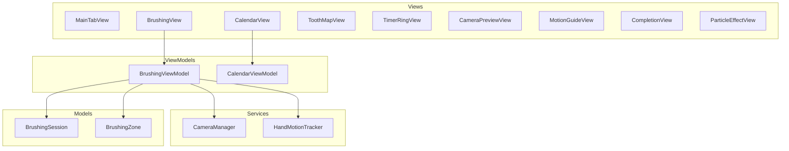

# Brushely


An iOS dental health app that guides users through brushing sessions with real-time motion tracking, interactive visuals, and habit analytics.

## Features

- **Guided Brushing Timer** — 2-minute session with ring indicator and zone-by-zone progression
- **Interactive Tooth Map** — visual dental zone map showing brushing coverage in real time
- **Hand Motion Tracking** — CoreMotion accelerometer/gyroscope analysis for brushing movement detection
- **Camera Preview** — live camera feed for brushing posture awareness (AVFoundation)
- **Particle Effects** — animated sparkle rewards on zone completion
- **Brushing Calendar** — track history, streaks, and consistency over time
- **Animated UI** — breathing backgrounds, animated tooth visuals, status overlays

## Architecture

The project follows **MVVM (Model-View-ViewModel)** with SwiftUI:



## Quick Start

### Requirements

- iOS 17.0+
- Xcode 15.0+

### Build & Run

1. Clone the repository:
   ```bash
   git clone https://github.com/damn888daniel/brushely-ios.git
   ```
2. Open `Brushely.xcodeproj` in Xcode
3. Select a target device or simulator
4. Build and run (Cmd+R)

> **Note:** Camera and motion features require a physical device.

## Project Structure

```
brushely-ios/
├── Brushely/
│   ├── App/
│   │   └── BrushelyApp.swift         # App entry point
│   ├── Models/
│   │   ├── BrushingSession.swift      # Session data model
│   │   └── BrushingZone.swift         # Dental zone definitions
│   ├── ViewModels/
│   │   ├── BrushingViewModel.swift    # Brushing session logic
│   │   └── CalendarViewModel.swift    # Calendar and streak tracking
│   ├── Views/
│   │   ├── MainTabView.swift          # Tab navigation
│   │   ├── BrushingView.swift         # Main brushing session screen
│   │   ├── CalendarView.swift         # Brushing history calendar
│   │   ├── ToothMapView.swift         # Interactive dental zone map
│   │   ├── TimerRingView.swift        # Circular timer indicator
│   │   ├── CameraPreviewView.swift    # Live camera feed
│   │   ├── MotionGuideView.swift      # Motion tracking guidance
│   │   ├── CompletionView.swift       # Session completion screen
│   │   ├── ParticleEffectView.swift   # Sparkle reward animations
│   │   ├── ZoneGuideView.swift        # Zone-specific brushing guide
│   │   ├── StatusOverlayView.swift    # Real-time status overlay
│   │   ├── AnimatedToothView.swift    # Animated tooth visual
│   │   └── BreathingBackgroundView.swift # Ambient breathing animation
│   ├── Services/
│   │   ├── CameraManager.swift        # AVFoundation camera integration
│   │   └── HandMotionTracker.swift    # CoreMotion motion analysis
│   ├── Extensions/                    # Color and utility extensions
│   └── Assets.xcassets/               # App icons, images, colors
├── Brushely.xcodeproj
└── project.yml
```

## Tech Stack

| Technology | Purpose |
|---|---|
| **Swift 5.9** | Primary language |
| **SwiftUI** | Declarative UI framework |
| **AVFoundation** | Camera preview and media handling |
| **CoreMotion** | Accelerometer and gyroscope for hand motion tracking |
| **Combine** | Reactive data binding |

## License

This project is available for personal and educational use.
